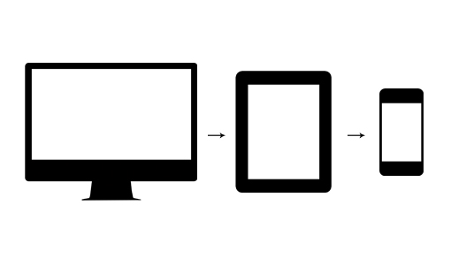
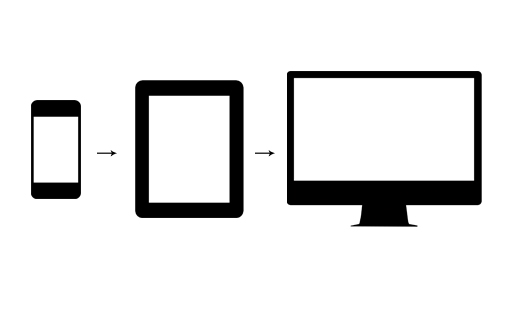
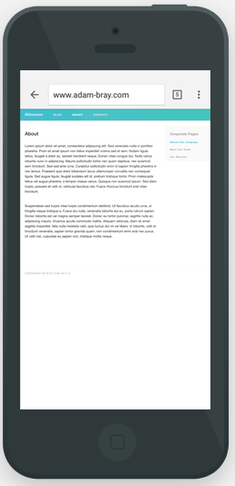

### Mobile first design

#### What is mobile first design?

Mobile first design is the practice of designing your site or app initially for a mobile interface, then on larger screens; on tablets then laptops then desktops/large monitors.

Traditionally, the standard process has been to design a website with a desktop or laptop display in mind and then later to think about how to make it look acceptable on smaller screens, by using percentage withs or appling media queries.



That made sense at the time, but the mobile web market has and continues to surge over the last 5 years. Comscore reported that from 2013 to 2014 mobile web traffic increased it's share of overall web traffic from 50% to 60% [citation need].

 


#### Why would you use it?

If a site is created for desktop, with high resolution images; and the mobile is expected to load these; particularly on a device with a 3g or 2g connection (which is commonplace in much of the world), the performance implications will be devastating.

When a phone loads a site, if the site has to trawl through loads of desktop focussed css before reaching relevant media queries, it will add a small amount of load time to the site and increase processing consumption. With that approach the mobile media queries are just undoing all the styles which have already been set for desktop. What a waste!

##### When mobiles are an afterthought, it can lead to poor UX on mobiles

On a desktop, it is acceptable to have a vast amount of content on a page. If this is ported to mobile without using a mechanism to compact the information - such as tabbed content or accordions - the user will have to scroll for potentially unacceptable amount of time to reach the content they are after.

#### How would you implement it?

##### Viewport meta tag

```html
<meta name="viewport" content="width=device-width, initial-scale=1" />

```

By including this meta tag in the head of the HTML document, the browser is being told to set the style width as the device with, and for the zoom level to be set to one initially (it does not disable zoom, which is a good idea as not being able to zoom can lead to a very bad UX). Without this tag, a mobile device with a pixel with of 1080px will display the site as you would see it on desktop, but squashed into 3 inches of screen.



##### Media queries (reversed)

Build the site with the css targeted at mobiles at the top of the css file, and user media queries lower down which target larger screens.

```css
@media (min-width: 40em) {
  .sidebar {
     float: left;
     width: 25%;
  }

  .content {
     float: left;
     width: 75%;
  }
}
```

Using min-width media queries, the browser is being told only to apply the styles when the width is over `40em`. This avoids setting a sidebar design, only to overwite it lower down the style sheet.


##### The tel: URI scheme

```html
<a href="tel:+4474204201337">+4474204201337</a>
```

Mobiles have the ability to make phone calls. If you see a number on a website, and have to copy and paste it to make a phone call, it will be a hassle and you will be less inclined to do so.


With the above code, the user can tap the link, and the phone will ask if you want to call that number.


> Ultimately, mobile first responsive web design comes down to using Progressive Enhancement as a foundation for web strategy and design.


### Progressive enhancement

#### What is it?

Progressive enhancement is about starting the design and creation of a web app by creating a feature minimal but sleek and compatible app. Once a fast and cross-compatable site has been created successive features can be built in for browsers and devices that support more modern/intensive features.

#### Why would you use it?

Instead of using progressive enhancement methodology one might begin the creation of a site by creating and designing a feature complete site that working on modern desktop browsers.

The the site could be adapted so that the less compatible features drop away for non-compatable devices/browsers.

This can be non-ideal; since the original design of the site was not aimed at old browsers/mobile creating the slimmed down version at the end of the project may result in an unimpressive / badly designed site.  

#### How would you implement it?

A basic example of building a site using progressive enhancement would be first building the HTML in the best, most expressive way possible, then styling it with cross-compatable CSS features. Once the site is looking great with this minimal design one could further style it with more modern CSS and basic JS. Near the end of the project you would be adding the most advanced JS features. This way your project has a solid cross-compatable foundation and extends itself to use more modern features on better browsers.

### links
- [Creating a Mobile-First Responsive Web Design](http://www.html5rocks.com/en/mobile/responsivedesign/)
- [Mobile First Design: Why It’s Great and Why It Sucks](https://codemyviews.com/blog/mobilefirst)
